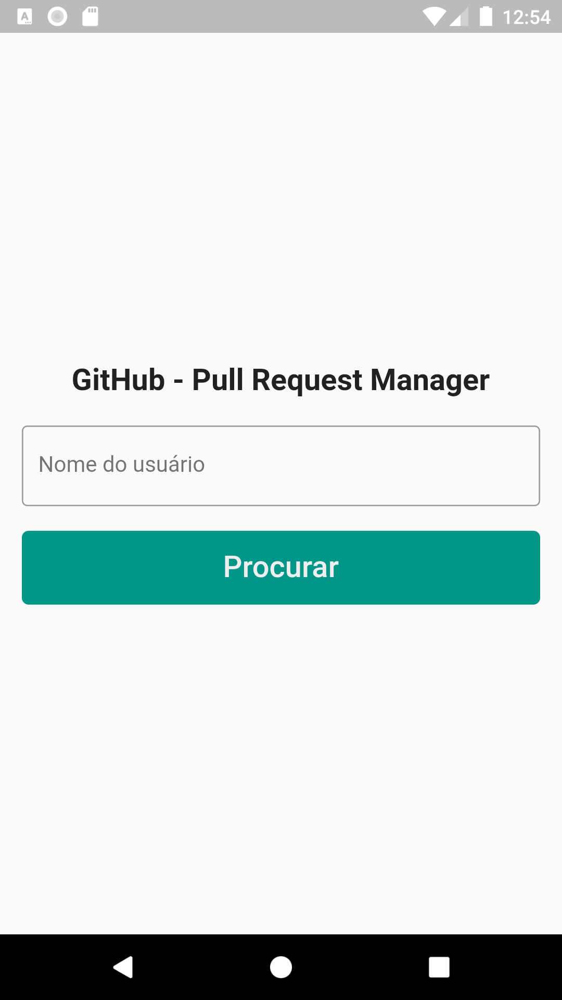
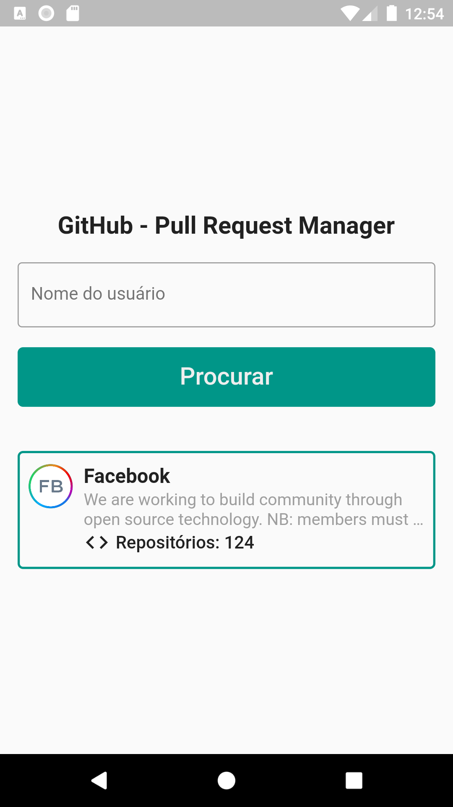
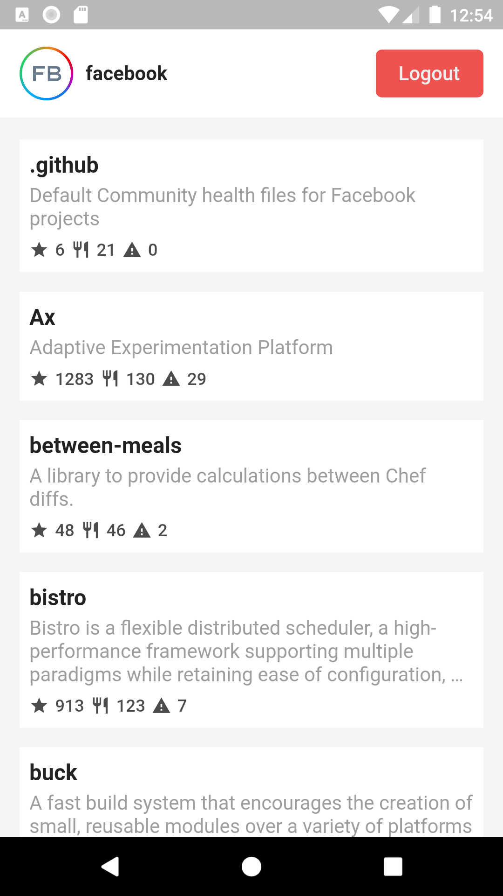
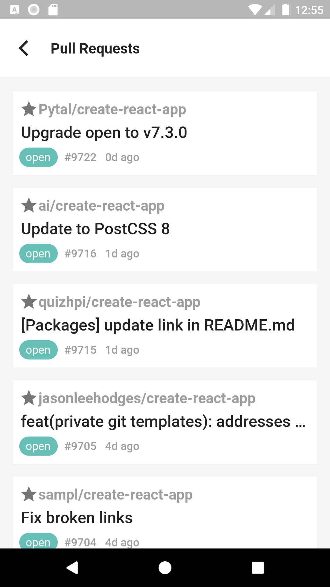
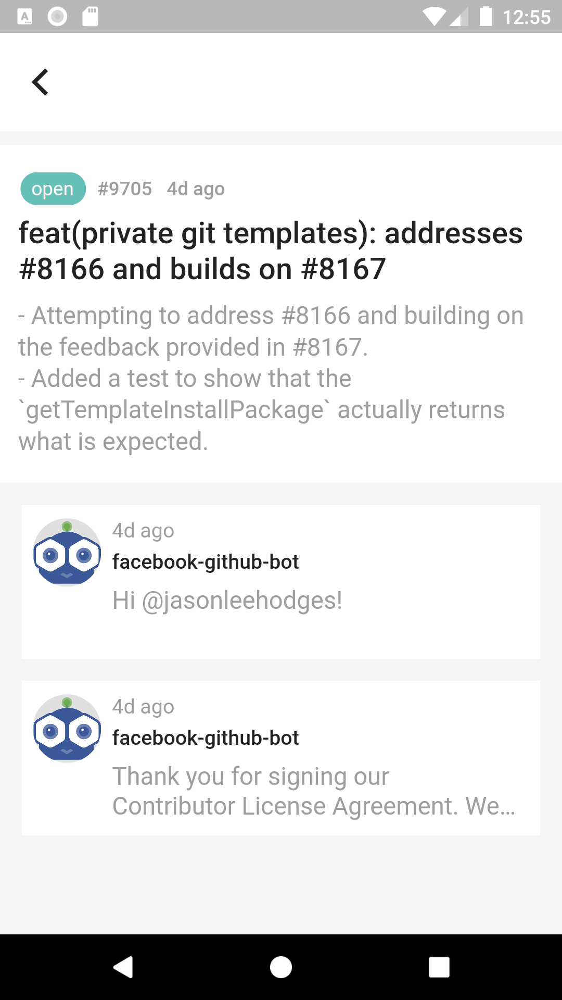

# Pull Request Manager

Um gerenciador de pull requests para o GitHub.

|                           |                           |                           |                           |                           |
| :-----------------------: | :-----------------------: | :-----------------------: | :-----------------------: | :-----------------------: |
|  |  |  |  |  |
|                           |                           |                           |                           |                           |

### Como rodar

```sh
flutter packages get
flutter run
```

### Como instalar

```sh
flutter build apk --split-per-abi
flutter install
```

### Estrutura/Arquitetura do projeto:

```sh
├── lib
│   ├── blocs
│   │   ├── bloc.dart
│   │   ├── comment_bloc.dart
│   │   ├── pull_request_bloc.dart
│   │   ├── repository_bloc.dart
│   │   └── user_bloc.dart
│   ├── data
│   │   ├── data_providers
│   │   │   └── github_provider.dart
│   │   ├── models
│   │   │   ├── comment.dart
│   │   │   ├── comment.g.dart
│   │   │   ├── pull_request.dart
│   │   │   ├── pull_request.g.dart
│   │   │   ├── repository.dart
│   │   │   ├── repository.g.dart
│   │   │   ├── user.dart
│   │   │   └── user.g.dart
│   │   └── repositories
│   │       ├── comment_repository.dart
│   │       ├── pull_request_repository.dart
│   │       ├── repository_repository.dart
│   │       └── user_repository.dart
│   ├── main.dart
│   ├── setup_locator.dart
│   ├── shared
│   │   ├── contants.dart
│   │   └── strings.dart
│   └── ui
│       ├── screens
│       │   ├── home
│       │   │   ├── home_screen.dart
│       │   │   └── widgets
│       │   │       └── user_info.dart
│       │   ├── pull_request
│       │   │   ├── detail_screen.dart
│       │   │   ├── pr_screen.dart
│       │   │   └── widgets
│       │   │       ├── detail_item.dart
│       │   │       ├── pr_item.dart
│       │   │       └── pr_status.dart
│       │   └── repository
│       │       ├── repo_screen.dart
│       │       └── widgets
│       │           ├── bottom_item.dart
│       │           └── repo_item.dart
│       └── widgtes
│           ├── back_button.dart
│           └── loading.dart
```

### Pacotes/Depências do projeto:

```sh
flutter: >=2.7.0 <3.0.0
http: ^0.12.2
json_annotation: ^3.1.0
provider: ^4.3.2+2
get_it: ^5.0.1
build_runner:
json_serializable: ^3.5.0
```
